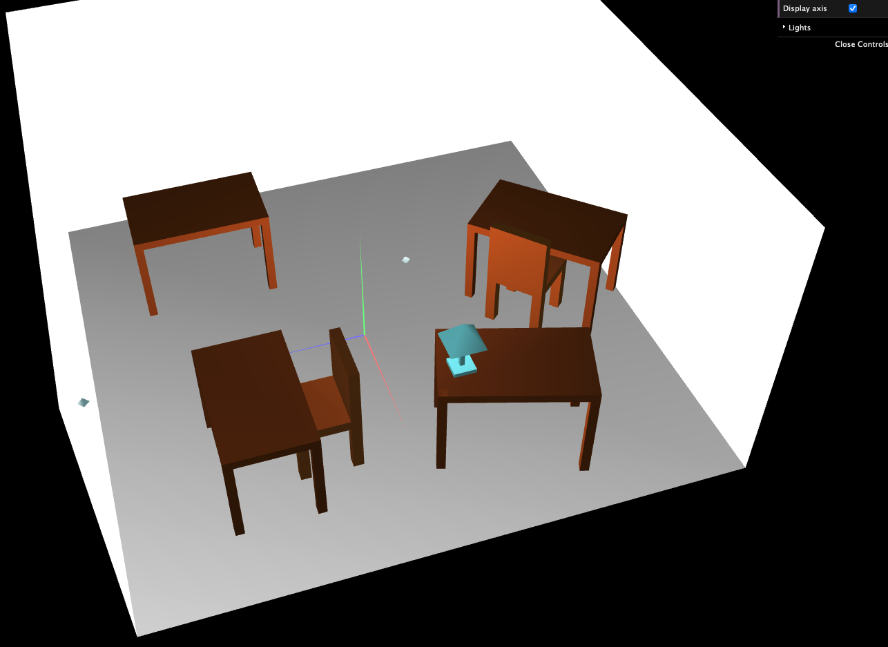
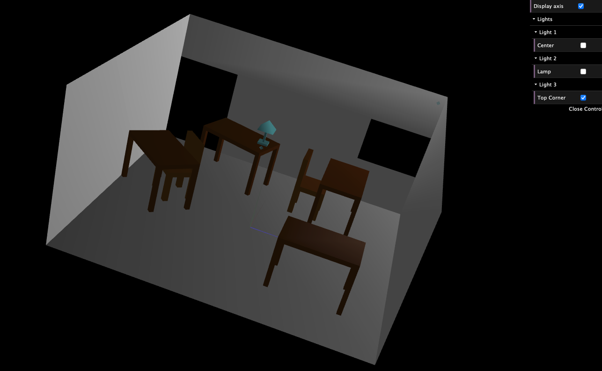
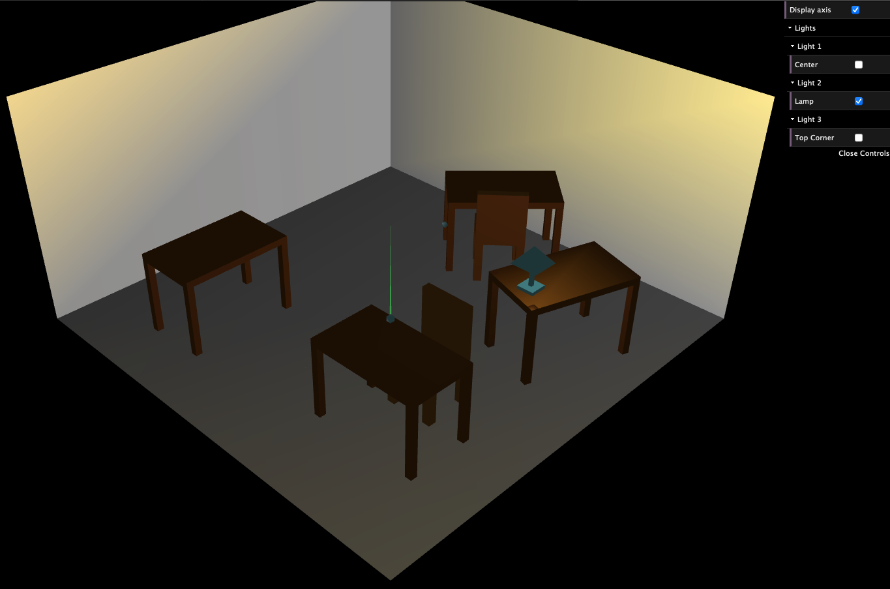

# SGI 2022/2022 - Project 1

# Group T02G01

| Name             | Number    |
| ---------------- | --------- | 
| David Ferreira   | 202102686 | 
| Bernardo Ferreira| 201806581 |

## Project Notes

This project includes de creation of a room with four tables, two chairs, four walls, a floor, a lamp and 3 lights that can be controlled through an interface. For that, it we used WebCGF (a WebGL library). 

The main difficulty found during the implementation of this project was related to the work with lights to create a more "real" scene with optimized reflections. 

## Screenshots

### 1 - Overall View

### 2 - Overall View with a single light on.

### 3 - Overall View with the lamp light on.

