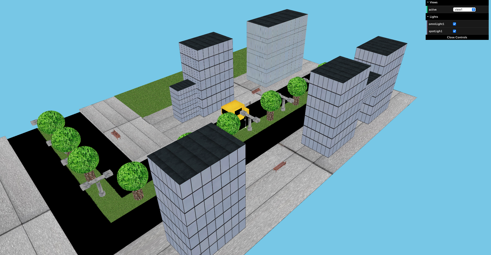
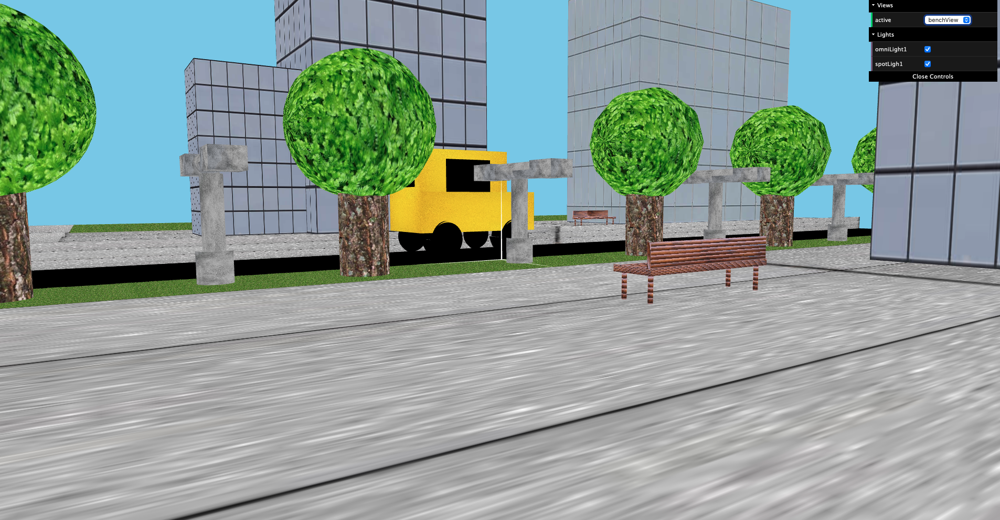

# SGI 2022/2022 - Project 2

# Group T02G01

| Name              | Number    |
| ----------------  | --------- | 
| David Ferreira    | 202102686 | 
| Bernardo Ferreira | 201806581 |

## Project Notes

This project consist on the creation of an application that makes it possible to produce graphical scenes that are specified on a XML file. It has a parser that takes input in the form of a xml file and builds the appropriate data structures that can be used to generate the respective image. 

## Screenshots

### 1 - Overall Rear View 

### 2 - Overall Lateral View

### 3 - Bench View

